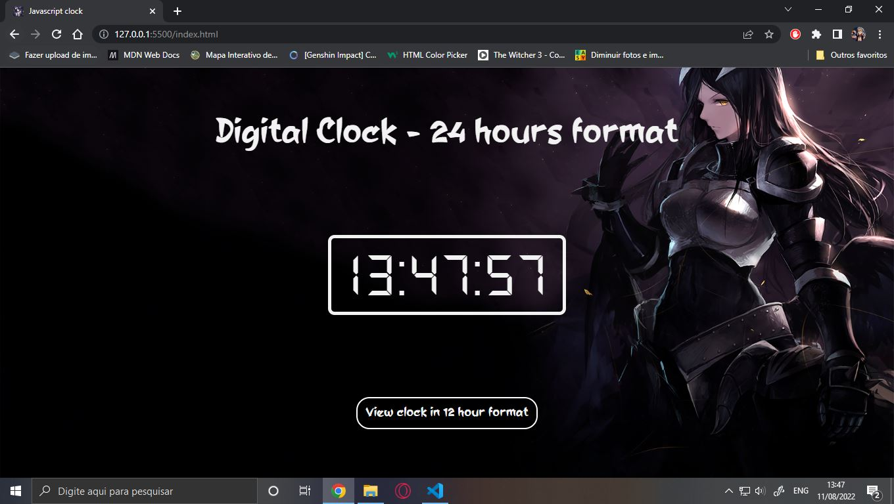
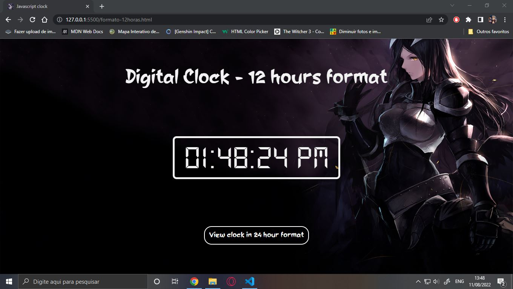

<h1 align = "center"> Hello guys! Welcome to my project. </h1>
 
<h2 align = "center"> In this project I made a Javascript clock</h2>
 

The clock is available in 12 hour and 24 hour format. In the images below it is in 24 hour and 12 hour format.

 

 
 

 
